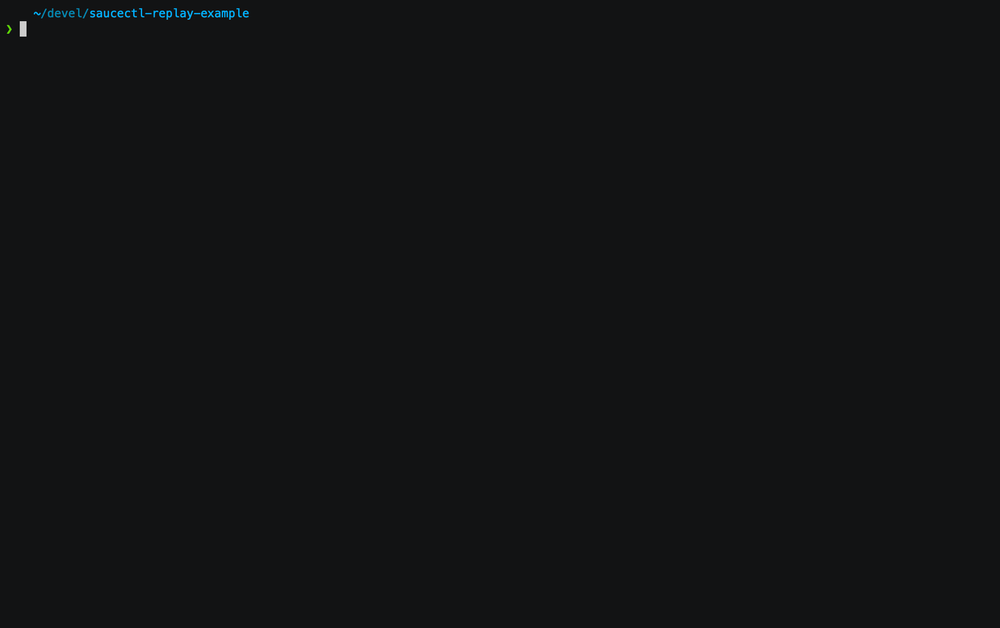

# saucectl replay example

Example running saucectl with [puppeteer replay](https://github.com/puppeteer/replay) recordings.

## What You'll Need

The steps below illustrate one of the quickest ways to get set up. If you'd like a more in-depth guide, please check out
our [documentation](https://docs.saucelabs.com/dev/cli/saucectl/#installing-saucectl).

### Install `saucectl`

```shell
npm install -g saucectl
```

### Set Your Sauce Labs Credentials

```shell
saucectl configure
```

## Running The Examples

Simply check out this repo and run the command below 🚀

```shell
saucectl run
```



## The Config

[Follow me](.sauce/config.yml) if you'd like to see how saucectl is configured for this repository.

Our IDE Integrations (e.g. [Visual Studio Code](https://docs.saucelabs.com/dev/cli/saucectl/usage/ide/vscode)) can help you out by validating the YAML files and provide handy suggestions, so make sure to check them out!


## Create Your Recording

You are ready to create your own recordings now! [Check out this thorough guide](https://developer.chrome.com/docs/devtools/recorder/) on how to do so with Chrome DevTools.
